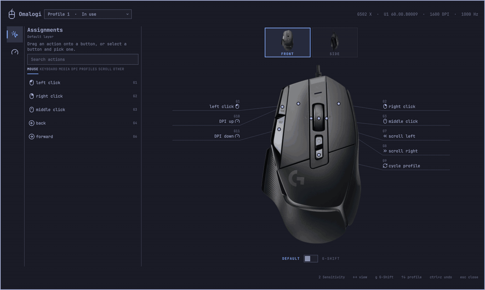
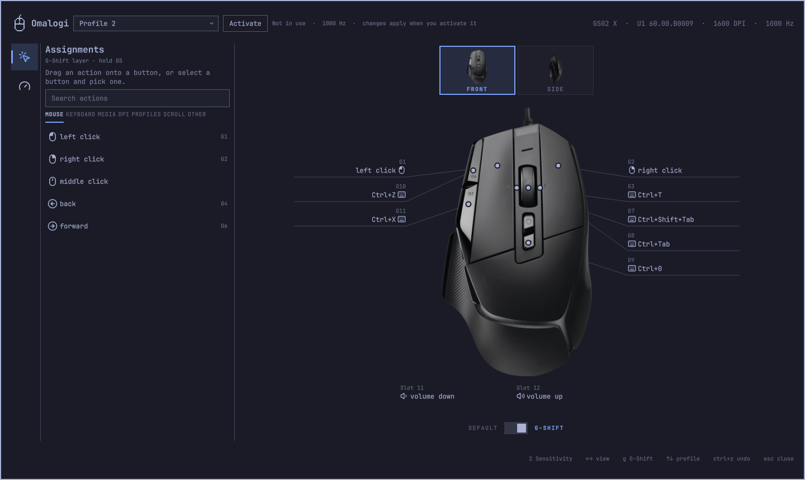

# Omalogi


Configure Logitech G-series mice on [Omarchy](https://omarchy.org): onboard profiles,
DPI stages, report rate and button bindings, automatic profile switching per app and
per monitor, and an overlay and bar indicator that follow your Omarchy theme.

Omalogi talks to the mouse over HID++ 2.0, writes only what you change, backs up the
mouse's profile memory before every write, and reads every write back to verify it.



## Supported devices

| Device | USB id | Status |
|---|---|---|
| Logitech G502 X (wired) | 046d:c099 | **Verified** on real hardware (firmware U1 60.00.B0009) |
| Logitech G502 Hero (wired) | 046d:c08b | **Verified** on real hardware (firmware U1 27.03.B0010) |
| Other wired G-series mice with onboard profiles | see below | **Untested** |

Untested mice use the same onboard memory family as the G502 X, which libratbag reads and
writes with one layout, so Omalogi can read and edit them. Nobody has checked them with
Omalogi yet, though: the first time you edit one, Omalogi asks you to accept that
(`omalogi accept-untested`, or a button in the overlay). Every write is still backed up,
read back and verified. Then please use **Help verify it** in the overlay: it opens a
Mouse report for your model, where you can report how it went or claim the model and run
the 15-minute self-test that makes it verified for everyone.

<details>
<summary>Untested wired models</summary>

G102/G203 (c084, c092, c09d), G302 (c07f), G303 (c080), G303 Shroud Edition (c097),
G402 (c07e), G403 (c083), G403 Hero (c08f), G403 Wireless (c082),
G502 Hero Wireless (c08d), G502 Proteus Core (c07d), G502 Proteus Spectrum (c332),
G502 X Lightspeed (c098), G502 X Plus (c095), G703 (c087), G703 Hero (c090), G705 (c096),
G900 (c081), G903 (c086), G903 Hero (c091), G Pro (c085, c08c), G Pro Wireless (c088),
G Pro X Superlight (c094), MX518 (c08e). Wireless models are listed here with their USB id
for a cable connection.

</details>

<details>
<summary>Untested wireless models, through a LIGHTSPEED, Bolt or Unifying receiver</summary>

G305, G403 Wireless, G502 Hero Wireless, G502 X Lightspeed, G502 X Plus, G602, G603,
G604, G703, G703 Hero, G705, G900, G903, G903 Hero, G Pro Wireless, G Pro X Superlight.
Omalogi finds them with [OpenLogi](https://github.com/AprilNEA/OpenLogi)'s device layer,
which handles the receivers, and edits them the same way as a wired mouse. A mouse
plugged in with its cable is used first.

</details>

Mice without onboard profiles, such as the MX series, are not supported: for those,
see [OpenLogi](https://github.com/AprilNEA/OpenLogi). To help verify a mouse, see
[#15](https://github.com/elberacasa/omalogi/issues/15), which lists every model and who
is verifying it.

## Features

- **Device info**: firmware, current DPI and sensor range, report rates, onboard mode.
- **Profiles**: list the onboard profiles with DPI stages and both button tables
  (normal and G-Shift), and switch the active profile.
- **Editing**: DPI stages, default and DPI-shift stage, report rate, button and G-Shift
  bindings (mouse buttons, keys with modifiers, media keys, DPI and profile actions).
- **Backup and restore** of all profile memory.
- **Automatic switching**: `omalogi daemon` watches Hyprland focus and activates the
  profile your rules pick for the focused app or monitor.
- **Omarchy shell plugin**: a G HUB-style editor (the mouse with a label per button, a
  searchable action library, a shortcut recorder, DPI levels and report rate) that saves each change
  to the mouse within about a third of a second, with Undo, and a bar indicator showing
  the active profile, both themed by Omarchy.
- **JSON output** for every command, for scripts and Hyprland bindings.

## Safety

Writing onboard memory is the risky part of any mouse tool. Omalogi:

- saves a backup of all profile memory to a new file before every write
  (`$XDG_STATE_HOME/omalogi/backups/`), never overwriting an older backup;
- patches only the bytes an edit changes in the profile it read from the mouse and
  recomputes the checksum, so data it does not decode is preserved;
- validates every value against what the mouse reports (DPI list, report rates,
  real button slots) and refuses anything else with a reason;
- reads each write back and compares it; on a mismatch it writes the previous
  contents back and tells you whether that worked;
- never writes the factory profiles, and never flashes firmware;
- keeps its daemon off the device while a write is in progress.

Every Omalogi process holds a device lock while it talks to the mouse, because requests
from two processes at once can time out or read back the wrong bytes; any profile data
that fails its checksum is read again and otherwise refused, never edited. A backup still
saves such a sector as read, flagged, and a restore never writes it back.

Every command that writes has a `--dry-run` that shows the exact change without writing.
Hardware test results are logged in [docs/hardware-tests.md](docs/hardware-tests.md).

## Install

Omalogi is an Omarchy shell plugin. Add it like any other:

```sh
omarchy plugin add https://github.com/elberacasa/omalogi --enable
```

Then open Omalogi from the bar. The first time, it offers to install its helper: the
`omalogi` command that talks to the mouse, and a udev rule that lets your user reach it
(a plugin runs inside the shell and cannot open USB devices itself). That opens a
terminal running the installer, which checks the download's SHA-256 and asks for sudo
once. `omarchy plugin update` keeps the plugin current, and Omalogi tells you when its
helper needs updating too.

To run the helper installer yourself, from the plugin folder:

```sh
bash ~/.config/omarchy/plugins/io.github.elberacasa.omalogi/install.sh
```

It downloads the release binary from this repository, checks its SHA-256, installs
`omalogi` to `~/.local/bin` and the udev rule below, and runs `omalogi setup`; run it
again to update. On Arch you can instead install the
[`omalogi`](packaging/aur/omalogi) AUR package and run `omalogi setup`.

## Dependencies

- **Omarchy 4** (omarchy-shell, Hyprland): the plugin, bar indicator and automatic
  switching run inside it.
- **The `omalogi` helper**: the release binary from this repository (installed by
  `install.sh` or the AUR package), or built from source with Rust 1.98 or newer. The
  plugin cannot open USB devices itself.
- **A udev rule** (`packaging/udev/70-omalogi.rules`) that gives your login session access
  to supported Logitech mice and receivers; installing it asks for `sudo` once.
- **Optional**: `systemd --user` for the automatic switching daemon, and an internet
  connection the first time a mouse picture is downloaded from `assets.openlogi.org`
  (the overlay works without pictures).
- **Libraries and data**: OpenLogi's device crates (MIT OR Apache-2.0) for receivers and
  HID++, and libratbag's device database (MIT) for model ids; see [Credits](#credits).

## Install from source

Requirements: Omarchy 4 (Hyprland, omarchy-shell), a Rust toolchain (1.98 or newer).

```sh
git clone https://github.com/elberacasa/omalogi
cd omalogi
cargo build --release
install -Dm755 target/release/omalogi ~/.local/bin/omalogi
```

**Device access.** Install the udev rule, which gives your login session access to the
mouse's HID++ interface only:

```sh
sudo install -Dm644 packaging/udev/70-omalogi.rules /usr/lib/udev/rules.d/70-omalogi.rules
sudo udevadm control --reload-rules
sudo udevadm trigger --subsystem-match=hidraw --action=change
```

**Set up for your user.** One command, no root:

```sh
omalogi setup --dry-run   # see what it would change
omalogi setup
```

It installs the shell plugin (built into the binary, so it always matches it) into
`~/.config/omarchy/plugins`, puts the indicator on the right of your bar, enables the
automatic switching daemon as a systemd user service, and checks that the mouse is
accessible. It only touches Omalogi's own entries. `--no-bar` and `--no-daemon` skip
those steps. Run it again after upgrading.

**Arch Linux.** `packaging/aur/omalogi` holds the PKGBUILD, which installs the binary,
the udev rule and the systemd unit; then run `omalogi setup` as your user.

## Usage

```sh
omalogi info                       # device, firmware, DPI, report rate, mode
omalogi profiles                   # profiles, DPI stages, bindings
omalogi profiles activate 2        # switch the active profile
omalogi profiles enable 3          # turn a profile on (disable turns it off)
omalogi backup                     # save all profile memory to a file
omalogi restore FILE --dry-run     # see what restoring would write
omalogi profiles repair --dry-run  # check a profile directory that fails its checksum
```

Edit a profile, preview first:

```sh
omalogi profiles edit 1 --dpi 400,800,1600,3200 --default-dpi 800 --dry-run
omalogi profiles edit 1 --rate 500
omalogi profiles edit 3 --name "Gaming"
omalogi profiles edit 2 --button 6=key:ctrl+t --gshift 11=media:mute
```

Button actions: `left`, `right`, `middle`, `back`, `forward`, `button:N`, `dpi-up`,
`dpi-down`, `dpi-cycle`, `dpi-default`, `dpi-shift`, `gshift`, `profile-next`,
`profile-previous`, `profile-cycle`, `scroll-left`, `scroll-right`, `scroll-up`,
`scroll-down`, `key:<combo>` (e.g. `key:ctrl+shift+t`), `media:<name>` (`volume-up`,
`volume-down`, `mute`, `play-pause`, `next-track`, `previous-track`), `disabled`.
Slot numbers are the ones `omalogi profiles` lists.

A shortcut is up to four modifiers (`ctrl`, `shift`, `alt`, `super`) and one key: `a`–`z`,
`0`–`9`, `f1`–`f24`, `enter`, `esc`, `backspace`, `tab`, `space`, `minus`, `equal`,
`leftbracket`, `rightbracket`, `backslash`, `semicolon`, `apostrophe`, `grave`, `comma`,
`period`, `slash`, `capslock`, `printscreen`, `scrolllock`, `pause`, `insert`, `home`,
`pageup`, `delete`, `end`, `pagedown`, `left`, `right`, `up` or `down`.

When stages change, the default and DPI-shift stages keep their DPI values; if a value
is removed you are asked to pick one with `--default-dpi` or `--shift-dpi`.

The mouse loads a profile's settings only when it switches to that profile. So when you
change the profile in use, Omalogi switches to another enabled profile and straight back
after the verified write, and the mouse uses the change at once. A change to any other
profile applies when you activate it. Every write and restore says which happened.

Add `--json` to any command for machine-readable output.

### Overlay

Open it from the bar indicator or with:

```sh
omarchy-shell shell toggle io.github.elberacasa.omalogi '{}'
```

Every profile opens ready to edit, including profiles that are turned off on the mouse.

- **Assignments** shows the mouse one view at a time, as G HUB does: the **Front** and
  **Side** picture tiles above it switch views (dragging an action over a tile switches
  too), and the **Default / G-Shift** switch underneath swaps layers. Drag an action from
  the library onto a button, or select a button and pick one.
  The library is grouped (mouse, keyboard, media, DPI, profiles, scroll) and searchable,
  and shows which buttons already use each action. A selected button offers **Use
  default** (the mouse's own factory binding), **Disable**, and **Record a shortcut…**,
  which records the keys you press as physical keys, so your keyboard layout does not
  matter.
- **Sensitivity** puts every DPI level on one bar: drag a level to change it, or away from
  the bar to remove it, click the bar to add one, and set the default and DPI shift
  levels. The report rate is below.
- Changes save themselves. A pick, a click or a released slider is written to the mouse
  almost at once; a typed value waits for a short pause. The footer says when the change
  is in use, or that it applies once you activate the profile. Before the first write of
  a session, all profile memory is backed up, and every write is read back to verify it.
- **Undo** (or `Ctrl+Z`) first drops a change that has not been written yet, then puts
  back what each earlier write replaced, one at a time. Switching profiles or closing
  the overlay saves what is pending first.

Keys: `↑`/`↓` or `j`/`k` switch profile, `←`/`→` or `h`/`l` switch view, `g` switches
between the default and G-Shift layers, `1` `2` switch page, `Enter` activates the
profile, `Ctrl+Z` undoes, `Ctrl+S` saves now, `r` refreshes, `Esc` clears the selection
and then closes.

The overlay talks to the mouse through `omalogi serve`, one long-lived connection that
starts when the overlay opens and stops after it closes, so edits do not wait for a
process to start or the whole profile memory to be read again.

| G-Shift | Sensitivity |
| --- | --- |
|  |  |

Omalogi does not ship the mouse pictures: the first time, `omalogi picture` downloads your
model's render and button positions (about 9 MB for the G502 X) from `assets.openlogi.org`,
the asset host OpenLogi uses, checks them against the host's checksums and caches them in
`~/.cache/omalogi/pictures`. After that nothing is downloaded unless you run
`omalogi picture --refresh`. Without a picture the buttons are shown as cards alone.

To open on a profile, view or button (handy for a Hyprland binding):

```sh
omarchy-shell shell toggle io.github.elberacasa.omalogi '{"profile":2,"tab":"gshift","button":3}'
```

`tab` is `buttons`, `gshift` or `sensitivity`; `button` is a slot number.

### Automatic switching

Rules live in `~/.config/omalogi/config.toml`. The first matching rule wins; a rule may
match an app (Hyprland window class, case-insensitive), a monitor (Hyprland monitor
name), or both:

```toml
# Profile to use when no rule matches. Leave it out to keep the current profile.
default_profile = 2

[[rule]]
app = "cs2"
profile = 1

[[rule]]
monitor = "HDMI-A-1"
profile = 1
```

Find window classes with `hyprctl activewindow` and monitor names with `hyprctl monitors`.
The daemon picks up saved changes within a few seconds; a profile you choose on the mouse
stays active until focus changes. Its log: `journalctl --user -u omalogi`.

## Troubleshooting

| Problem | Fix |
|---|---|
| `permission denied opening /dev/hidrawN` | Install the udev rule above and replug the mouse. For one session: `sudo setfacl -m u:$USER:rw /dev/hidrawN`. |
| `no supported Logitech mouse found` | Plug a G-series mouse in over USB, or turn on a wireless one paired to its receiver. |
| `the onboard profile directory's checksum does not match` | `omalogi profiles repair --dry-run` checks that the directory's entries and every profile they list are intact; without `--dry-run` it backs up, rewrites only the directory and verifies it. The overlay offers the same repair. If it refuses, restore a backup made before the damage. |
| Overlay or indicator missing after an update | `omarchy-shell shell rescanPlugins`; if a new plugin file was added, restart the shell. |
| Indicator shows only the mouse icon | The daemon is not running: `systemctl --user status omalogi`. |
| An edit went wrong | `omalogi restore ~/.local/state/omalogi/backups/<file>` with the backup saved before it. |

## With OpenLogi

Omalogi uses the HID++ implementation from [OpenLogi](https://github.com/AprilNEA/OpenLogi)
(`openlogi-hidpp`) and runs alongside OpenLogi's agent: each process uses its own HID++
software id, so replies never cross. OpenLogi handles host-side features for many
Logitech devices; Omalogi adds the G-series onboard profile support, which OpenLogi does
not have yet, and the Omarchy integration.

## Uninstall

The uninstaller reverses the installer. It shows exactly what it will remove and asks
first; `--dry-run` only shows the plan:

```sh
bash ~/.config/omarchy/plugins/io.github.elberacasa.omalogi/uninstall.sh
```

It stops the daemon and removes its user unit, the helper in `~/.local/bin` and the udev
rule (sudo), then runs `omarchy plugin remove io.github.elberacasa.omalogi`, which unloads
Omalogi and takes it off the bar. If you installed the helper from the AUR, it leaves the
package alone; remove it with `sudo pacman -R omalogi`.

Your mouse keeps its onboard profiles: uninstalling changes nothing on it. Backups in
`~/.local/state/omalogi/backups/` and rules in `~/.config/omalogi/` are kept; delete them
if you no longer need them.

## Credits

- [libratbag](https://github.com/libratbag/libratbag) (MIT): onboard profile layout,
  button encodings and write sequence this project follows.
- [Solaar](https://github.com/pwr-Solaar/Solaar) (GPL-2.0): HID++ feature documentation
  and device dumps used to cross-check findings. No Solaar code is used.
- [OpenLogi](https://github.com/AprilNEA/OpenLogi): the `openlogi-hidpp` crate (0BSD).
- [Omarchy](https://omarchy.org) and [Quickshell](https://quickshell.org): the shell and
  theming the plugin is built on.

Not affiliated with Logitech. Logitech, G502 and G HUB are trademarks of Logitech.

## License

MIT OR Apache-2.0, at your option. See [LICENSE-MIT](LICENSE-MIT) and
[LICENSE-APACHE](LICENSE-APACHE).
